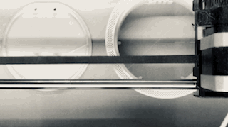

### Howdy!
I'm Taylor.

- 🌱 Currently: building pixel-perfect Dash apps + a microcontroller plant maintenence system.
- 😄 Pronouns: she/her
- ⚡ Fun fact: I love to make things! My first experience getting a machine to do something cool was designing + executing custom embroidery patterns on my mom's Bernina when I was ~10. Learn more about my artistic endeavors on my [website](https://halemade.com/) or find me on [Ravelry!](https://www.ravelry.com/people/halemade)

<!--
**halemade/halemade** is a ✨ _special_ ✨ repository because its `README.md` (this file) appears on your GitHub profile.

Here are some ideas to get you started:

- 🔭 I’m currently working on ...
- 🌱 I’m currently learning ...
- 👯 I’m looking to collaborate on ...
- 🤔 I’m looking for help with ...
- 💬 Ask me about ...
- 📫 How to reach me: ...
- 😄 Pronouns: she/her
- ⚡ Fun fact: ...
-->
