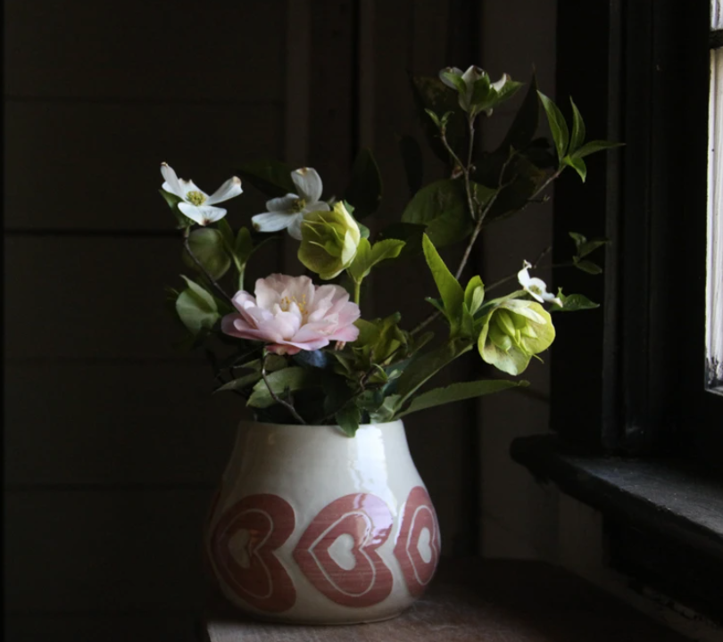

### Howdy!
I'm Taylor, and I think data is interesting and beautiful. I've worked to develop products for years and have been inspired by challenges in small-medium size business. I taught myself to code to solve problems but eventually wanted to upskill in a structured, immersive and challenging way. Was accepted to the Flatiron School in early 2021. On track to complete a Data Science certificate 10/2021!

- 🌱 I’m currently diving deep into ML agorithms
- 😄 Pronouns: she/her
- ⚡ Fun fact: I love all things crafty. Learn more about my artistic endeavors [here](https://halemade.com/) or find me on [Ravelry!](https://www.ravelry.com/people/halemade)

| i | love | building things |
| ------------- | ------------- | ------------- |
|    |    |    |

<!--
**halemade/halemade** is a ✨ _special_ ✨ repository because its `README.md` (this file) appears on your GitHub profile.

Here are some ideas to get you started:

- 🔭 I’m currently working on ...
- 🌱 I’m currently learning ...
- 👯 I’m looking to collaborate on ...
- 🤔 I’m looking for help with ...
- 💬 Ask me about ...
- 📫 How to reach me: ...
- 😄 Pronouns: she/her
- ⚡ Fun fact: ...
-->
